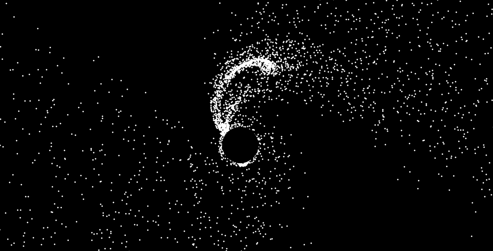
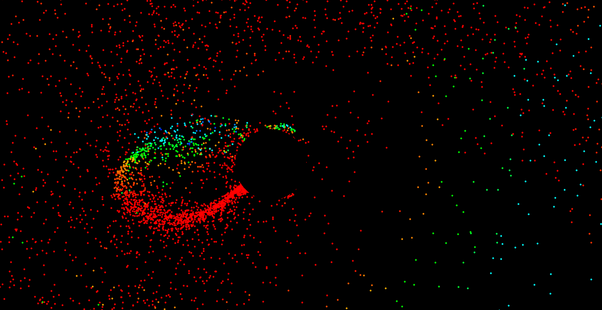
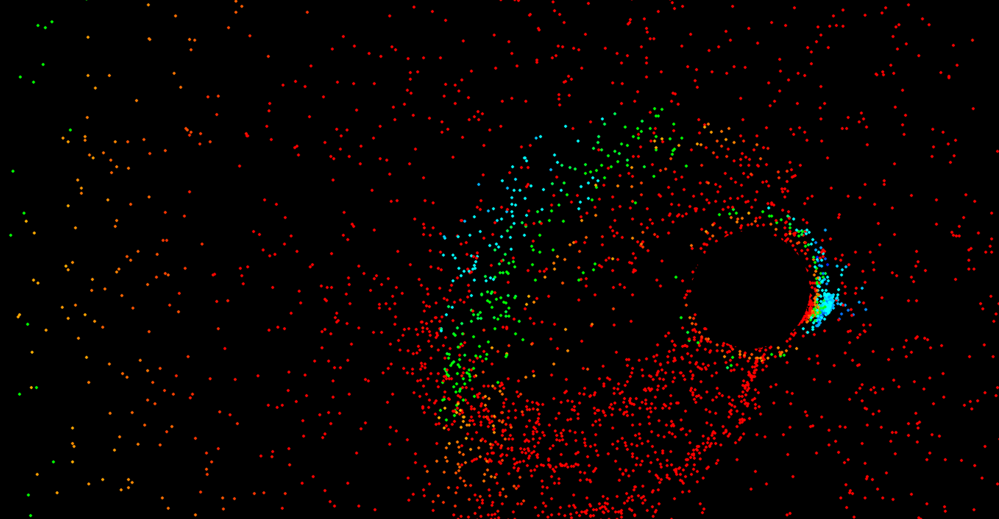
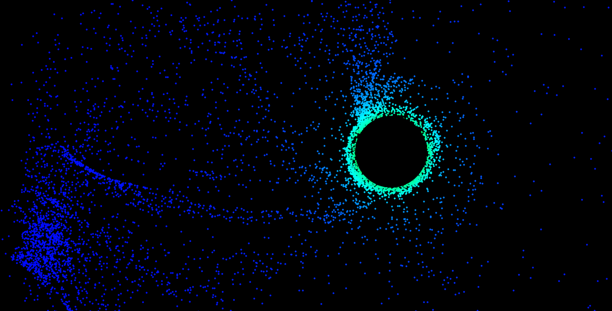

# **Particle Simulation: Black-Hole Gravitational Field**

This project simulates the gravitational pull of a black hole on nearby particles in real time, using **Python**.


<table>
  <td></td>
  <td></td>
</table>
<table>
  <td></td>
  <td></td>
</table>


## **Features**


- **Particle Simulation:** Particles are attracted to the black hole, with varying  velocities according to the gravitational pull they experience.


- **Dynamic Black Hole:** The black hole’s position can be controlled by mouse movements, creating a highly interactive experience.


- **Color-Coding:** On active, Particles show a color range from <span style="color:red">**Red**</span> to 
  <span style="color:green">**Green**</span> to 
  <span style="color:blue">**Blue**</span> depending on factors like Magnitude of force, velocity, etc.


- **Particle Size Variation:** On Active, Each particle is randomly assigned a radius from an array provided by user.


- **Web Version:** The simulation is available on the web via **Pygbag**, making it accessible without requiring Pygame installation.

## **Technologies Used**


- **Python:** The primary programming language used to develop the simulation.
- **Pygame:** For rendering graphics and handling program logic.
- **Pygbag:** To compile and run the Pygame project on the web.


## **Guidelines for Users**

**Note:** Ensure you have [Python](https://www.python.org/downloads/)
 installed on your system. If you encounter issues, consider using a virtual environment.

### **Installation**
To run the project locally:
1. Clone the repository: `git clone https://github.com/Rhishavhere/blackhole-gravitation.git`
2. Navigate to the project directory: `cd blackhole-gravitation`
3. Install required dependencies: `pip install pygame `
4. Run the project: `python main.py`

### **Configuration**
You are free to tweak simulation settings in the `config.py`

Window Settings :
``` 
WIDTH = 1920
HEIGHT = 1080
FPS = 60
```
Element Settings :
``` 
PARTICLE_SIZE = [1,2,4] 
BLACKHOLE_SIZE = 80
PARTICLE_DENSITY = 8000
```
Simulation Settings :
```
GRAVITATION_CONSTANT = 1000
FIELD_VARIATION = 1.5
TANGENTIAL_FACTOR = 0.3
MAX_VELOCITY = 8
```
Color Variation :

```
COLOR_VARIATION = 0   
```
`none = 0 `

`force based = 1 `

`velocity based =2 `
